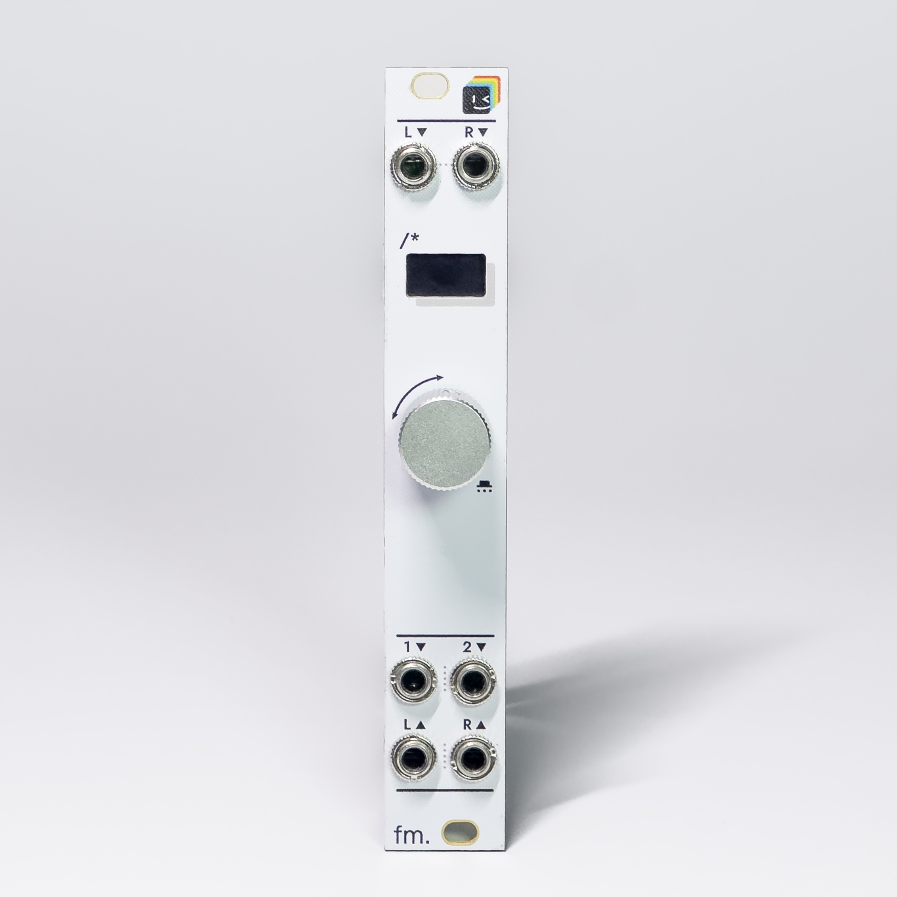
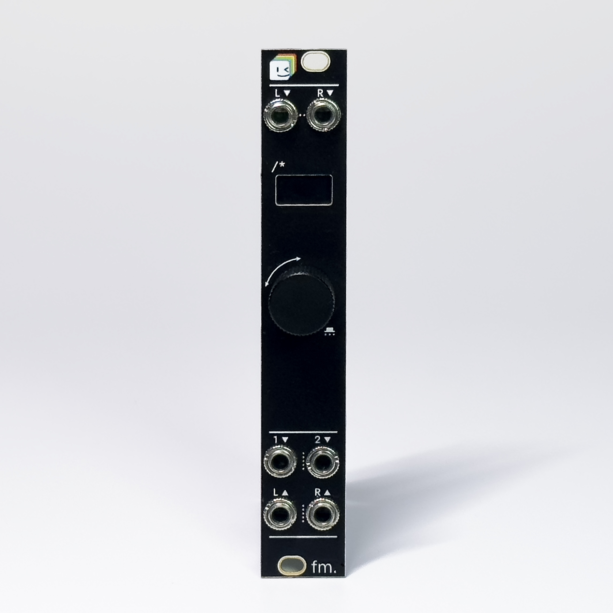
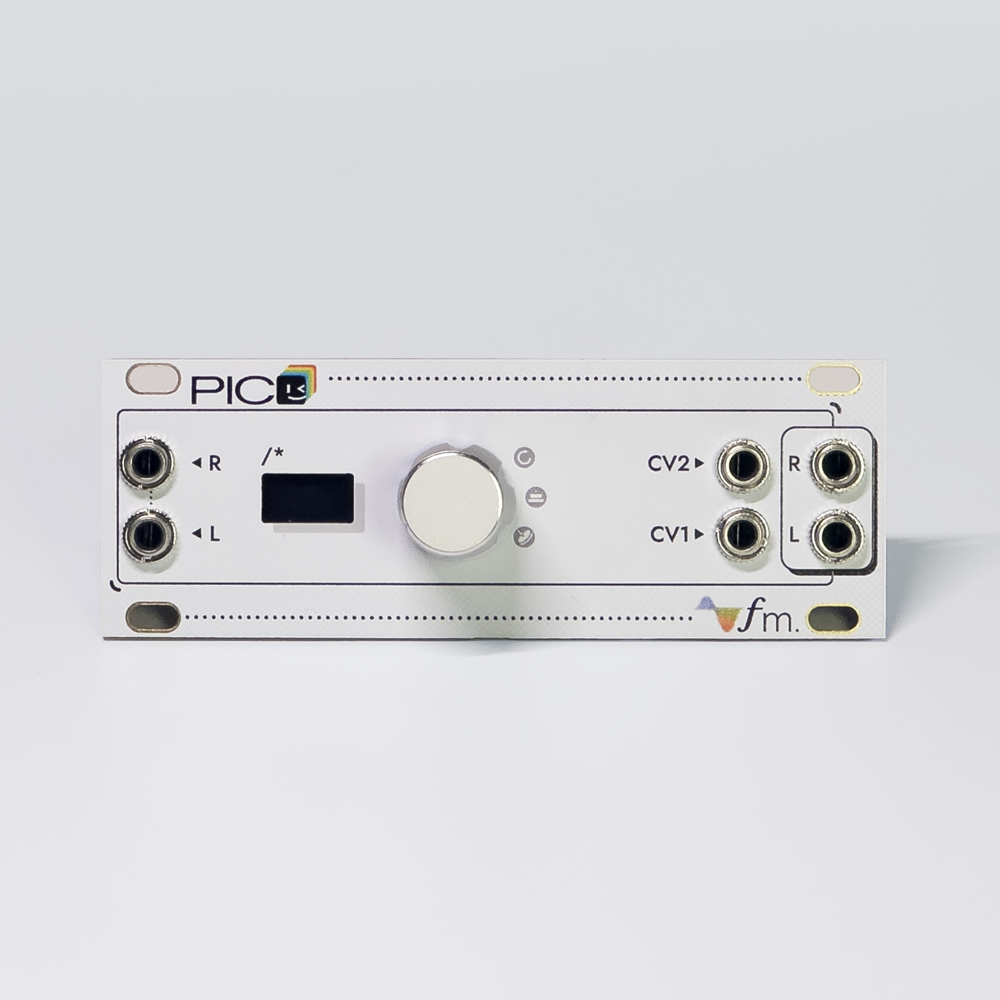
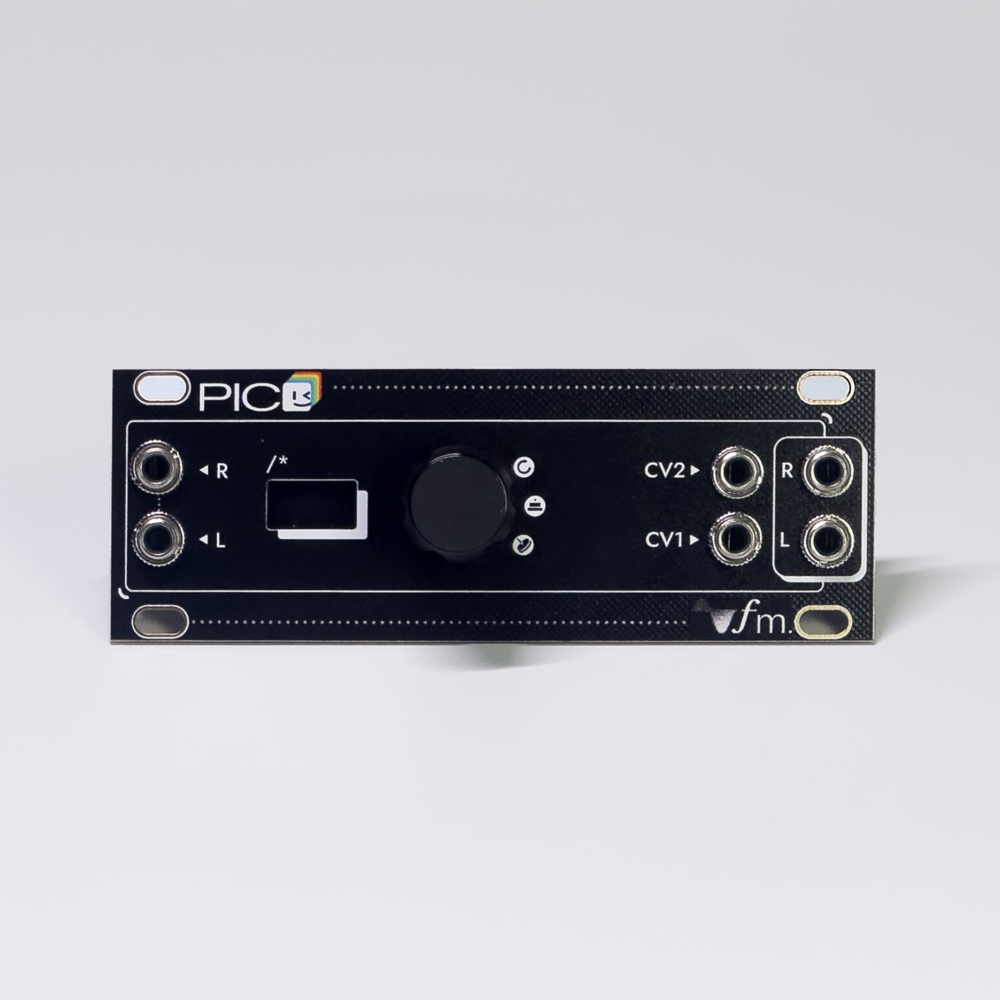
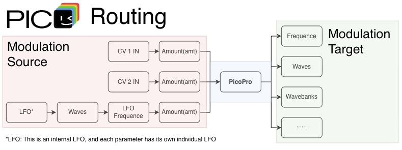

<p align="center">
  
</p>

# PicoPro Eurorack

PicoPro Eurorack 是一套基于4HPico DSP的二次开发模块，面向 RP2350 的多应用 DSP 固件。它把多个 Arduino-Pico 音频应用打包进一个 UF2，通过 64×32 OLED 和旋转编码器选择应用。

硬件项目：[2HPico Eurorack Module Hardware](https://github.com/rheslip/2HPico-Eurorack-Module-Hardware)

源项目地址：[4HPico DSP Eurorack Module](https://github.com/rheslip/4HPico-DSP-Sketches)

## 面板

### 3U 面板

| 白色面板 | 黑色面板 |
| :---: | :---: |
|  |  |

### 1U 面板

| 白色面板 | 黑色面板 |
| :---: | :---: |
|  |  |

## 功能

- 一个固件包含多个独立的 DSP 应用
- 启动选择器支持切换应用
- 支持立体声音频、CV、Gate、OLED 和旋转编码器
- 按应用实际大小分配 Flash 槽位
- 浏览器模拟器可预览菜单、图标和字体
- 灵活的外部CV路由与内部LFO调制

## 应用

应用和槽位配置位于 [`Bootloader/apps.json`](Bootloader/apps.json)。

| 槽位 | 应用 | 状态 |
| ---: | --- | --- |
| 0 | Delay | 可用 |
| 1 | Reverb | 可用 |
| 2 | Tuner | 敬请期待 |
| 3 | Wavetable | 可用 |
| 4 | Grain | 可用 |
| 5 | Rings | 可用 |
| 6 | Acid | 敬请期待 |
| 7 | Calibration | 可用 |
| 8 | Glitch | 可用 |
| 9 | Flanger | 可用 |
| 10 | Ducking | 可用 |
| 11 | Crush | 可用 |

Tuner 和 Acid 目前只显示 `coming soon`。Reverb 的全局 RAM 占用约为 78%，上机后需要重点测试稳定性。

## 内部路由



每个参数都可以选择 CV1、CV2的输入或内部 LFO 作为调制来源，并用 `Amount` 设置调制深度。内部 LFO 可单独设置波形和频率，每个参数都有自己的独立 LFO，互不影响。

## 环境要求

硬件需要 RP2350 和 4MB Flash。完整固件默认以 250MHz 构建。

构建工具：

- Arduino IDE 2.x 或 `arduino-cli`
- [Arduino-Pico](https://github.com/earlephilhower/arduino-pico)，已验证版本为 `5.5.0`
- Python 3 和 [Pillow](https://python-pillow.org/)
- CMake 3.13 或更高版本
- Ninja，推荐安装
- Pico SDK，可通过 `PICO_SDK_PATH` 指定

Arduino 库：

- Adafruit GFX Library
- Adafruit SSD1306
- pico-audio
- [DaisySP_Teensy](https://github.com/rheslip/DaisySP_Teensy)，供 Reverb 使用
- [arduinoMI](https://github.com/poetaster/arduinoMI) 中的 RINGS 和 STMLIB

`I2S`、`Wire` 和 `SPI` 由 Arduino-Pico 提供。项目自己的库在 `lib/PicoProlib`，构建脚本会自动加载。

## 构建

在仓库根目录执行：

```sh
python3 Bootloader/Tools/build_slots.py --package --clean
```

脚本会编译所有应用和启动选择器，然后生成：

```text
Bootloader/build/PicoPro_Firmware.uf2
Bootloader/build/PicoPro_Firmware.layout.json
Bootloader/build/slots/*.uf2
```

如果 Pico SDK 不在默认位置：

```sh
export PICO_SDK_PATH=/path/to/pico-sdk
python3 Bootloader/Tools/build_slots.py --package --clean
```

其他选项：

```sh
python3 Bootloader/Tools/build_slots.py --help
```

## 烧录与操作

1. 让 RP2350 进入 BOOTSEL 模式并连接电脑。
2. 将 `Bootloader/build/PicoPro_Firmware.uf2` 复制到 RP2350 USB 磁盘。
3. 重启后旋转编码器选择应用，按下进入。
4. 在应用内长按编码器约 1.8 秒，返回启动选择器。

烧录前请确认目标硬件使用 RP2350 和 4MB Flash。

## UI 模拟器

```sh
python3 sims/serve.py
```

浏览器地址为 `http://127.0.0.1:8765/sims/index.html`。

- `←` / `→`：旋转编码器
- `↓`：按下编码器
- 长按 `↓`：返回选择器
- `1` 到 `8`：快速进入应用
- `S`：返回选择器
- `R`：重置当前界面

模拟器读取实际的应用配置、selector 图标和 `Fonts/*.h`。详细说明见 [`sims/README.md`](sims/README.md)。

## 目录

```text
Apps/                  Arduino DSP 应用
Bootloader/            启动选择器、配置和构建工具
Fonts/                 OLED 字体
Images/                应用图标动画帧
Tools/                 音频资源转换工具
Web_images/            文档图片
lib/PicoProlib/        PicoPro 公共库
sims/                  UI 模拟器
```

`Bootloader/build/` 和 `reference/` 只在本地使用，不进入 Git。

## 添加应用

应用目录格式：

```text
Apps/MyApp/MyApp.ino
```

图标使用 64×32 PNG：

```text
Images/my_app_icon/my_app_icon-1.png
Images/my_app_icon/my_app_icon-2.png
```

预览并注册：

```sh
python3 Bootloader/Tools/register_placeholder_apps.py MyApp --dry-run
python3 Bootloader/Tools/register_placeholder_apps.py MyApp --require-icons
```

注册后重新构建完整固件。

## 更新音频资源

Grain 采样位于 `Apps/Grain/Samples/`：

```sh
python3 Tools/import_grain_samples.py
```

Wavetable 源文件位于 `Apps/Wavetable/waves/`：

```sh
python3 Tools/import_wavetables.py --help
```

转换后的 `.h` 文件由脚本生成，不要手动编辑。

## Credits

- [Rich Heslip](https://github.com/rheslip)：PicoPro 硬件、原始固件与 DSP sketches
- [Earle F. Philhower, III 及贡献者](https://github.com/earlephilhower/arduino-pico)：Arduino-Pico
- [Electro-Smith](https://github.com/electro-smith/DaisySP)：DaisySP DSP 库
- [Emilie Gillet / Mutable Instruments](https://github.com/pichenettes/eurorack)：Rings 和 STMLIB 原始代码
- [Mark Washeim](https://github.com/poetaster/arduinoMI)：Mutable Instruments Arduino 移植
- [Adafruit](https://github.com/adafruit)：Adafruit GFX 和 SSD1306 库

各上游项目保留其原有版权与许可证。发布固件或源码前，请同时检查所使用库的许可证要求。
